# Myroslava's Portfolio

A modern, responsive portfolio website built with Next.js, TypeScript, and Tailwind CSS. This portfolio showcases my skills, experience, and projects with a clean, minimalist design featuring a consistent color scheme and subtle animations.



## 🚀 Features

- **Modern Tech Stack**: Built with Next.js 15, React 19, TypeScript, and Tailwind CSS
- **Responsive Design**: Fully responsive layout that works on all devices
- **Component-Based Architecture**: Clean, maintainable code with reusable components
- **Optimized Performance**: Fast loading times with Next.js image optimization
- **Animated Elements**: Subtle animations and transitions for enhanced user experience
- **Consistent Styling**: Unified color scheme with CSS variables

## 🎨 Design System

The portfolio uses a consistent color scheme throughout:

- Primary dark: #1A3E5D (deep navy blue)
- Primary: #005F73 (teal)
- Primary light: #A1D6E2 (light blue)
- Accent: #E3F9F9 (pale blue)
- Background: #F7F9F9 (off-white)

Additional accent colors include vibrant orange (#FF9551) and mint (#64CCC5) used in gradient elements.

## 🧩 Project Structure

```
├── public/               # Static assets
│   ├── beyond-coding/    # Beyond coding related assets
│   ├── icons/            # Skill and social icons
│   ├── logo/             # Logo files
│   └── profile-photo/    # Profile photos
├── src/
│   ├── app/              # Next.js app router pages
│   ├── components/       # React components
│   │   ├── about/        # About page components
│   │   ├── contact/      # Contact page components
│   │   ├── experience/   # Experience page components
│   │   ├── home/         # Home page components
│   │   ├── layout/       # Layout components (Navbar, Footer)
│   │   └── ui/           # Reusable UI components
│   ├── config/           # Site configuration
│   ├── data/             # Data files for skills, navigation
│   ├── lib/              # Utility functions
│   └── styles/           # Global styles
```

## 🛠️ Getting Started

### Prerequisites

- Node.js 18.0 or later
- npm or yarn

### Installation

1. Clone the repository
```bash
git clone https://github.com/yourusername/myroslava-portfolio.git
cd myroslava-portfolio
```

2. Install dependencies
```bash
npm install
# or
yarn install
```

3. Run the development server
```bash
npm run dev
# or
yarn dev
```

4. Open [http://localhost:3000](http://localhost:3000) in your browser

## 🚢 Deployment

This project can be easily deployed to Vercel:

1. Push your code to a GitHub repository
2. Import the project to Vercel
3. Vercel will automatically detect Next.js and set up the build configuration

## 🧰 Technologies Used

- **Frontend Framework**: Next.js 15.3.1
- **UI Library**: React 19.0.0
- **Styling**: Tailwind CSS 3.3.2
- **Language**: TypeScript 5
- **Animation**: Framer Motion 12.11.0
- **Utility Libraries**: clsx, tailwind-merge

## 📝 Code Principles

This project follows several key principles:

- **DRY (Don't Repeat Yourself)**: Centralized data structures and reusable components
- **Component-Based Architecture**: Modular, reusable components
- **Responsive Design**: Mobile-first approach with Tailwind's responsive utilities
- **Accessibility**: Semantic HTML and proper ARIA attributes
- **Performance Optimization**: Next.js image optimization and code splitting

## 📄 License

This project is licensed under the MIT License - see the LICENSE file for details.
